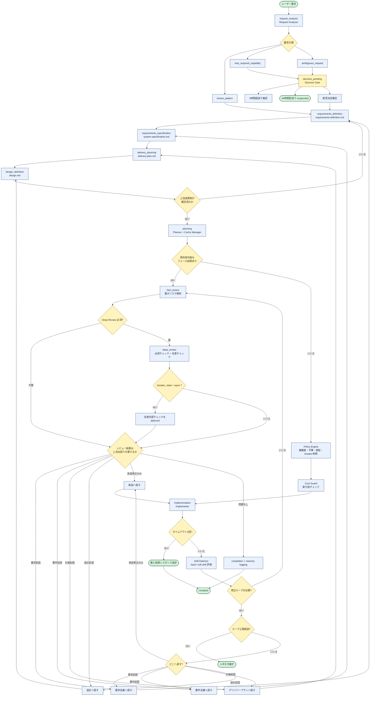

# Agent System Flow

以下は、現時点の要求定義・要件定義・粗設計をもとに整理した agent system の主要フローである。

補足:
- known_pattern は意思決定ゲートを省略できるが、要求定義から設計までの成果物差分確認は省略しない。
- new_required_capability と ambiguous_request は、意思決定または要求確定を経て、要求定義から設計までの上流成果物を更新してから実装に進む。
- complex だけでは Deep Review を必須化せず、高リスクまたは Fast Gate 重大検知時に限定する。
- breaker が open の場合でも必須レビューは継続し、任意の外部チェックのみ deferred とする。
- レビューや drift により上流原因が判明した場合は、該当工程へ出戻りし、関連成果物を更新してから再実行する。
