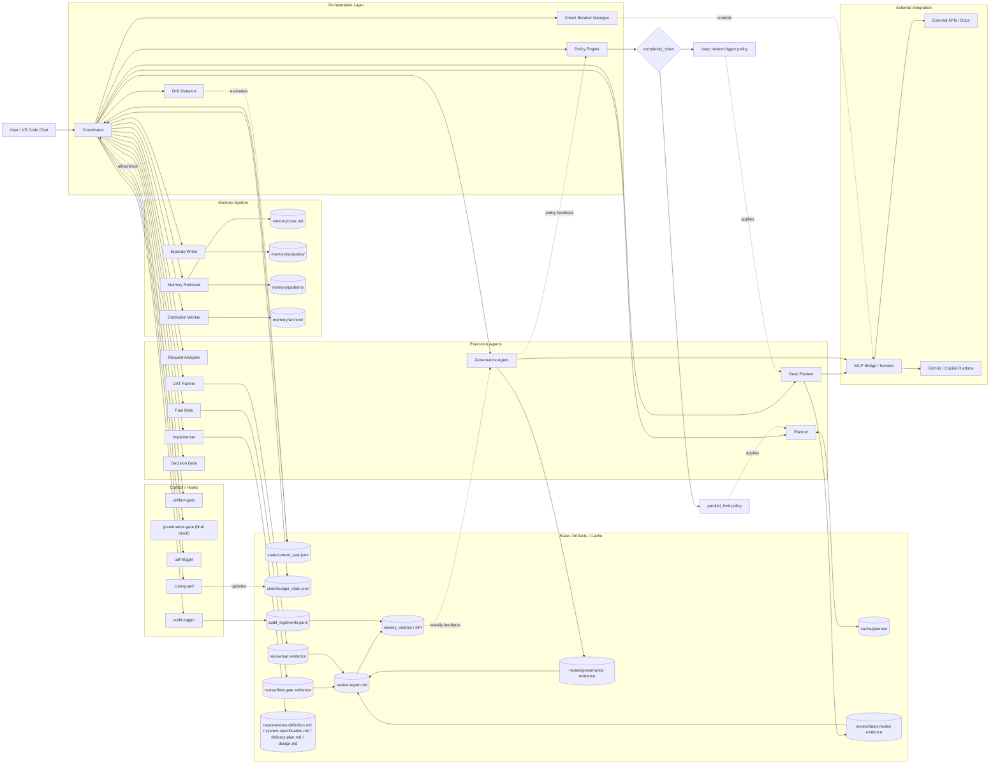

# システム構成全体図

最終更新: 2026-04-05

## 目的
現在のマルチエージェント実行基盤について、主要コンポーネントと接続関係を一枚で把握できるようにする。

## 判定
現時点の構成は、Coordinator を中核に、実行エージェント群、Hook 制御、状態管理、記憶管理、外部連携が分離されている。

## 根拠
- design.md のコンポーネント構成と主要フロー
- feature-design.md のプリミティブ構成と責務分離
- state/current_task.json の現行フェーズ定義
- agent-system-flow.md の工程フロー

## 修正計画
1. Cost Guard の最終責任を Hook 側に一本化し、Coordinator 側は呼び出し主体に限定する。
2. Governance Agent と governance-gate の責務境界を明確化し、最終ブロック判定を governance-gate に固定する。
3. レビュー証跡を Fast/Deep/Governance/UAT で分離し、統合レポートを別ノードで明示する。
4. complexity_class と KPI フィードバック経路を図示し、規模別制御と効果検証を可視化する。

## 修正設計
| 観点 | 修正前 | 修正後 |
|------|--------|--------|
| Cost Guard | ORCH に常駐機能として配置 | CTRL の `cost-guard` Hook を唯一の判定主体に変更 |
| Governance | Agent と Hook の主従が不明瞭 | Agent は分析・証跡作成、Hook は最終 allow/block 判定 |
| レビュー証跡 | review-report.md に多点直接書き込み | 段階別証跡を分離し、最後に統合レポートへ集約 |
| 規模別制御 | 図上で抽象化され可視性が低い | complexity_class 分岐と適用先を明示 |
| 効果測定 | 安全性補強の説明のみ | metrics ノードを介した週次ガバナンス反映を追加 |

## 実装
- Mermaid 図を責務分離版へ差し替え。
- Hook と Agent の境界、証跡分離、規模別制御、KPI ループを追加。

## 全体図

## 要点まとめ
- Coordinator が全体オーケストレーションと状態遷移を主導する。
- Cost Guard は Hook 側に一本化し、重複判定を解消した。
- Governance は Agent と Hook の責務を分離し、最終ブロック判定を Hook に固定した。
- レビュー証跡は段階別に分離し、統合レポートへ集約する構造へ変更した。
- complexity_class 分岐と KPI ループを明示し、規模別制御と効果検証の追跡性を高めた。

## レビュー
- 責任範囲: Cost Guard/Governance の境界を明確化し、重複責務を削減。
- 規模間: complexity_class に基づく制御点を追加し、Simple/Medium/Complex の差分を可視化。
- 分離の正しさ: Agent は分析、Hook はゲート判定という主従を明示。
- 重複排除: review-report への多点直書きを段階別証跡ノードに分離。
- 効果見込み: KPI フィードバック線により、週次ガバナンスでの改善循環を成立。

## 次アクション
1. 状態遷移専用図を別ファイル化し、構成図との責務を完全分離する。
2. review/fast, review/deep, review/governance, review/uat の実ファイル設計を追加する。
3. docs 配下へ移動する場合は README.md から参照リンクを追加する。
